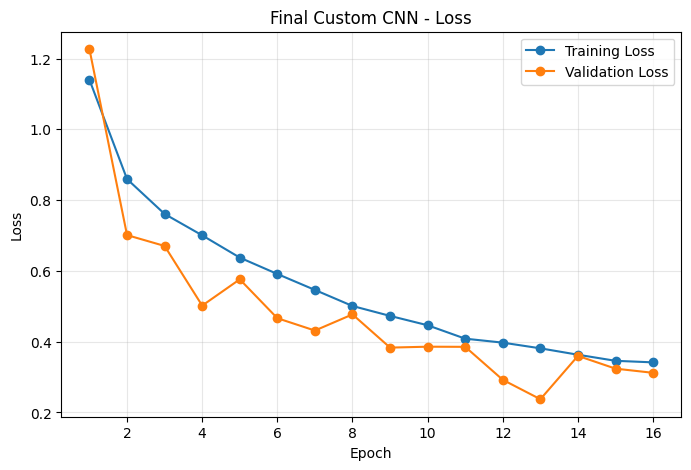
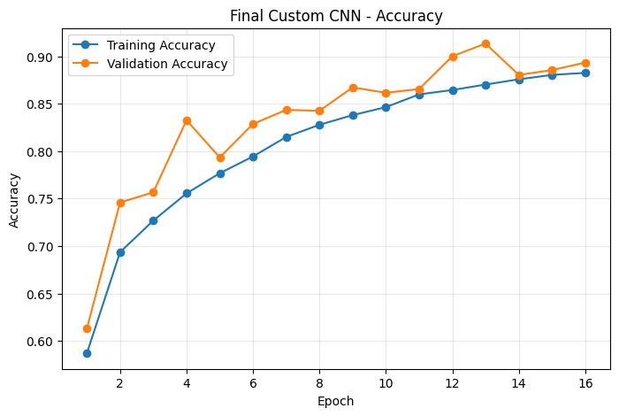
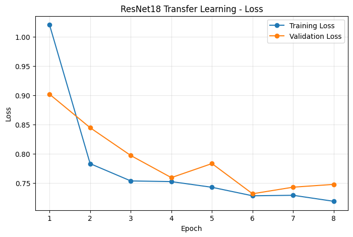
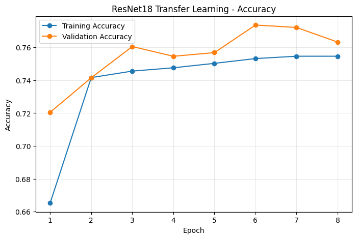
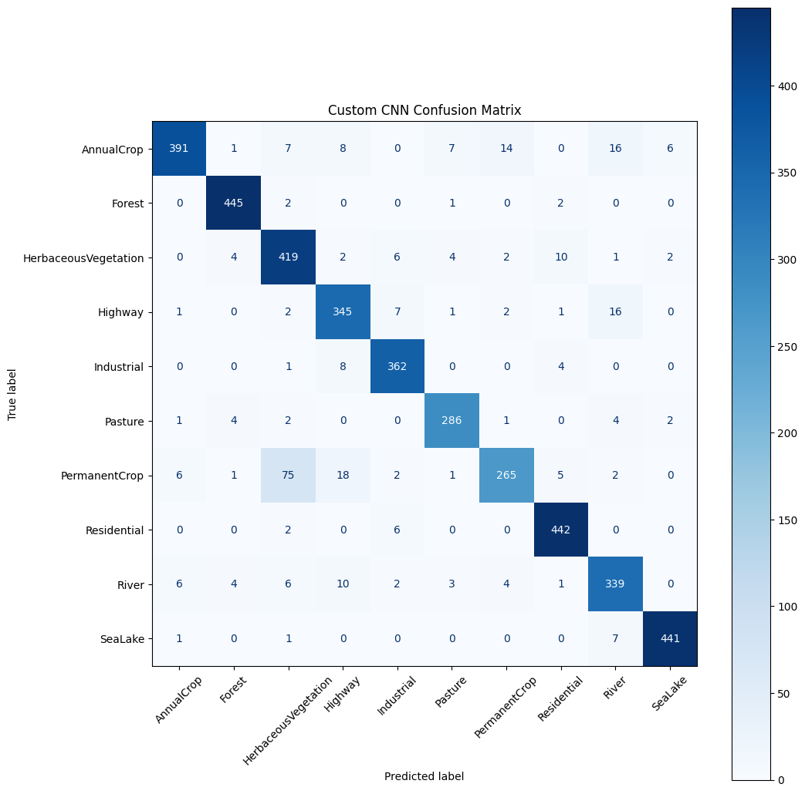
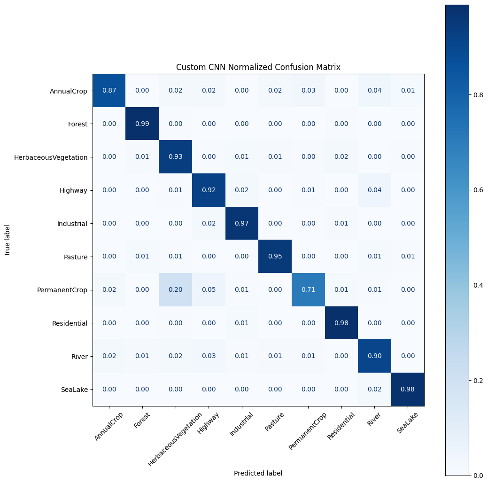
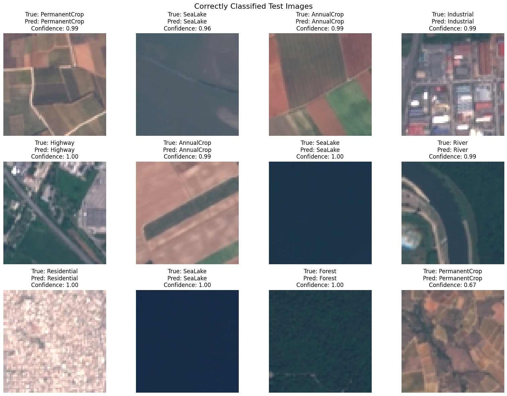
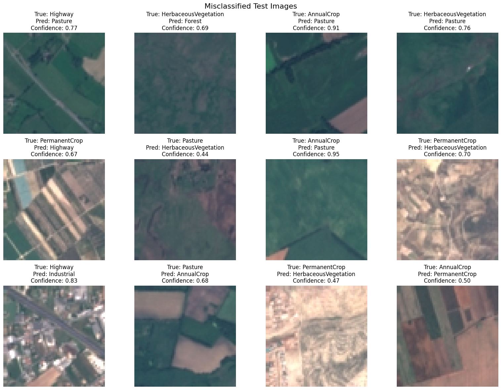

# EuroSAT Satellite Image Classification

A PyTorch capstone project that classifies satellite images into 10 land-use categories.

## Project Overview

This project builds and evaluates deep learning models for satellite image classification using the EuroSAT RGB dataset.

The project compares:

1. A custom convolutional neural network trained from scratch
2. A pretrained ResNet18 model used for transfer learning

The workflow includes preprocessing, data augmentation, stratified dataset splitting, hyperparameter tuning, early stopping, model testing, confusion matrices, and misclassification analysis.

## Dataset

The EuroSAT RGB dataset contains 27,000 satellite images across 10 classes:

- AnnualCrop
- Forest
- HerbaceousVegetation
- Highway
- Industrial
- Pasture
- PermanentCrop
- Residential
- River
- SeaLake

The dataset was split into:

- Training: 70%
- Validation: 15%
- Test: 15%

## Models

### Custom CNN

The custom CNN uses four convolution blocks with batch normalization, ReLU activation, max pooling, adaptive average pooling, dropout, and fully connected layers.

### ResNet18

The ResNet18 model uses pretrained ImageNet features. Its feature layers were frozen and the final classification layer was replaced with a 10-class layer.

## Hyperparameter Tuning

The best custom CNN setting was selected using the **lowest validation loss**.

| Experiment | Learning Rate | Batch Size | Dropout | Best Validation Loss | Validation Accuracy at Best Loss |
|---|---:|---:|---:|---:|---:|
| Experiment 1 | 0.0010 | 32 | 0.30 | **0.4315** | 84.35% |
| Experiment 2 | 0.0005 | 32 | 0.30 | 0.4616 | 83.46% |
| Experiment 3 | 0.0010 | 64 | 0.50 | 0.6106 | 78.67% |

Experiment 1 was selected for the final custom CNN because it achieved the lowest validation loss.

## Final Results

| Model | Validation Accuracy | Test Accuracy | Precision | Recall | F1-score |
|---|---:|---:|---:|---:|---:|
| Custom CNN | 91.33% | **92.22%** | **92.44%** | **92.22%** | **92.12%** |
| ResNet18 | 77.36% | 78.67% | 78.78% | 78.67% | 78.37% |

The custom CNN achieved the best overall performance.

## Training Curves

### Custom CNN





### ResNet18





## Confusion Matrix



The most difficult class was **PermanentCrop**, with a recall of **70.67%**. It was most frequently predicted as **HerbaceousVegetation**. In the test set, **75 PermanentCrop images** were classified as HerbaceousVegetation.



## Prediction Examples

### Correct Predictions



### Misclassified Predictions



## Main Findings

- The custom CNN achieved **92.22%** test accuracy.
- Its weighted F1-score was **92.12%**.
- ResNet18 achieved **78.67%** test accuracy in the frozen-feature setup.
- Forest and SeaLake were among the easiest classes.
- PermanentCrop was the most difficult class.
- The largest confusion was PermanentCrop being predicted as HerbaceousVegetation.

## Project Structure

```text
Capstone-Project-Deep-Learning-with-PyTorch/
├── EuroSAT_Capstone_Project.ipynb
├── README.md
├── requirements.txt
├── images/
├── results/
├── report/
├── presentation/
└── docs/
```

## Installation and Running

```bash
python -m venv venv
venv\Scripts\activate
pip install -r requirements.txt
jupyter lab
```

Open `EuroSAT_Capstone_Project.ipynb` and run the cells from top to bottom.

The uploaded notebook already contains the completed outputs and figures.

## Future Improvements

- Unfreeze some ResNet18 feature layers
- Use a larger input image size
- Try ResNet34 or EfficientNet
- Add Grad-CAM visualizations
- Use more focused augmentation for difficult vegetation classes

## Author

**Name:** Jianye Chen  
**College:** Fanshawe College  
**Course:** Deep Learning Capstone  
